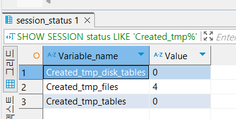

# 9.2.기본 데이터 처리
## 9.2.1 풀 테이블 스캔과 풀 인덱스 스캔
- 풀 테이블 스캔을 사용하는 경우
1. 테이블 레코드 건수가 적어서 인덱스보다 풀 테이블 스캔이 더 빠를 때
2. WHERE, ON 절에 적절한 인덱스 없는 경우
3. 인덱스 레인지 스캔을 사용할 수 있는 쿼리지만 조건 일치 레코드 건수가 너무 많은 경우

- 풀 테이블 스캔의 경우 페이지를 한번에 몇 개씩 가져오나?
    - InnoDB의 경우 백그라운드 스레드에서 **리드** 어헤드(read ahead) 작업을 함
    - 리드 어헤드(read ahead): 어떤 영역의 데이터가 필요할지 예측해 버퍼 풀에 저장해두는 것
    - 포그라운드 스레드 -> 백그라운드 스레드로 읽기 작업 넘김 (최대 64개 페이지까지 읽어서 저장)
    - 포그라운드 스레드는 버퍼풀에 저장된 데이터를 가져옴
    - innodb_read_ahead_threshold 시스템 변수: 언제 리드 어헤드를 시작할 지 임계값 설정. 이 시스템 변수에 설정된 개수만큼 연속된 페이지가 읽히면 버퍼 풀로 적재 시작

    ```sql
    SHOW VARIABLES LIKE 'innodb_read_ahead_threshold';
    ```

## 9.2.2 병렬 처리
- 하나의 쿼리를 여러 스레드가 작업을 나누어 동시에 처리하는 것
- innodb_parallel_read_threads 시스템 변수: 하나의 쿼리를 최대 몇 개의 스레드를 이용해 처리할지
- MySQL 8.0 에서는 WHERE 조건 없이 단순히 테이블 전체 건수를 가져오는 쿼리만 병렬 처리 가능
    ```sql
    SELECT count(*) FROM employees;
    ```

## 9.2.3 ORDER BY 처리(Using filesort)
1. 인덱스 이용
2. Filesort 이용 (실행계획에서 Extra 컬럼에 "Using filesort"라고 표시됨)
- 모든 정렬을 인덱스로 하지 못하는 이유는 뭘까?
    1. 정렬 기준이 너무 많은 경우
    2. GROUP BY / DISTINCT 처리 결과를 정렬해야 하는 경우
    3. UNION 과 같이 임시 테이블의 결과를 정렬해야 하는 경우
    4. 랜덤하게 레코드를 가져와야 하는 경우

### 9.2.3.1 소트 버퍼
- sort_buffer_size 시스템 변수로 소트 버퍼의 크기를 설정 가능
- 정렬해야 할 레코드 건수가 소트 버퍼 공간보다 큰 경우
    => 디스크에 임시 저장하게 됨
    => 이후 버퍼에 정렬된 레코드와 머지해서 정렬 수행: 멀티 머지(Multi-merge)
- 멀티 머지 횟수는 Sort_merge_passes 라는 상태 변수에 누적해서 집계 됨

- 소트 버퍼 크기를 크게 설정하면 되지 않나?
    - 실제 벤치마크 결과 큰 차이를 보이지 않음.
    - 저자에 따르면 소트 버퍼의 크기 256KB ~ 8MB 사이가 최적의 성능을 보였음.   
    - 소트 버퍼는 글로벌 메모리 영역(x), 세션 메모리 영역(o), 즉 클라이언트 마다 생기는 메모리 영역이므로 과도하면 메모리 공간이 부족해짐

### 9.2.3.2 정렬 알고리즘
- 정렬 대상이 되는 컬럼만 가져오는지 여부에 따라 싱글 패스(Single-pass) vs. 투 패스(Two-pass)

#### 9.2.3.2.1 싱글 패스 정렬 방식
- 정렬에 필요하지 않은 컬럼까지 전부 소트 버퍼에 담고 정렬 수행
- 더 큰 소트 버퍼의 크기가 필요함
- 최신 버전에서 사용
- 정렬 대상 레코드의 크기가 건수가 작은 경우 빠름

#### 9.2.3.2.2 투 패스 정렬 방식
- 싱글 패스와 반대
- 싱글 패스 이전에 사용하던 방식
- 특정 조건에서는 여전히 투 패스 방식 사용
- 테이블을 2번 읽어야 함
- 정렬 대상 레코드의 크기나 건수가 많은 경우 효율적

### 9.2.3.3 정렬 처리 방법
- ORDER BY 사용 시 처리 방법 3가지
    1. 인덱스 사용
    2. 조인에서 드라이빙 테이블만 정렬 -> (Extra) Using filesort
    3. 조인에서 조인 결과를 임시 테이블로 저장 후 정렬 -> (Extra) Using temporary; Using filesort

#### 9.2.3.3.1 인덱스를 이용한 정렬
- ORDER BY 절에 명시된 칼럼이 드라이빙 테이블에 있어야 하고 인덱스가 생성되어 있어야 함
- B-Tree 계열만 가능 (해시 인덱스, 전문 검색 인덱스, R-Tree 불가)

#### 9.2.3.3.2 조인의 드라이빙 테이블만 정렬
- 드라이빙 테이블 정렬 후 조인

#### 9.2.3.3.3 임시 테이블을 이용한 정렬
- 드리븐 테이블에 포함된 컬럼으로 정렬을 하는 경우 -> 조인 후 정렬할 수밖에 없음 (임시 테이블이 필요한 이유)
- 조인 결과를 임시 테이블에 저장 -> 이후 정렬

#### 9.2.3.3.4 정렬 처리 방법의 성능 비교
- GROUP BY, ORDER BY 는 LIMIT 건수만큼만 가져와서 처리하기 어려움 -> 성능이 떨어지는 이유
=> 하지만 조인 결과를 찾은 후 LIMIT 수 만큼만 정렬하면 멈추고 결과를 반환하므로 영향을 미침

##### 9.2.3.3.4.1 스트리밍 방식
- 조건에 일치하는 레코드를 검색될 때마다 바로 클라이언트로 전송

##### 9.2.3.3.4.2 버퍼링 방식
- GROUP BY, ORDER BY 는 스트리밍 방식이 불가능

#### 9.2.3.4 정렬 관련 상태 변수
```sql
SHOW STATUS LIKE 'Sort%';
```
- Sort_merge_passes: 멀티 머지 처리 횟수 -> 단위 정렬 작업의 결과를 병합 처리한 횟수
- Sort_range: 인덱스 레인지 스캔으로 검색된 결과에 대한 정렬 작업 횟수
- Sort_scan: 풀 테이블 스캔을 통해 검색된 결과에 대한 정렬 작업 횟수
- Sort_rows: 지금까지 정렬한 전체 레코드 건수

## 9.2.4 GROUP BY 처리
### 9.2.4.1 인덱스 스캔을 이용하는 GROUP BY(타이트 인덱스 스캔)
- 실행계획 Extra 칼럼에 별도로 표시되지 않음

### 9.2.4.2 루스 인덱스 스캔을 이용하는 GROUP BY
- 루스 인덱스 스캔: 인덱스의 레코드를 건너 뛰면서 필요한 부분만 읽어서 가져오는 것
- (Extra) Using index for group-by
- 다음 쿼리의 경우 (emp_no, from_date)로 인덱스가 생성되어 있음
    ```sql
    SELECT emp_no
    FROM salaries
    WHERE from_date = '1985-03-01'
    GROUP BY emp_no
    ```

### 9.2.4.3 임시 테이블을 사용하는 GROUP BY
- 인덱스를 사용하지 못하는 경우
- (Extra) Using temporary
- MySQL 8.0 이전 버전에서는 GROUP BY 와 함께 묵시적인 정렬까지 수행 => 8.0 버전 이후 수행하지 않음
- 이전 버전에서는 다음과 같은 쿼리를 권장했음 (묵시적인 정렬을 하지 않도록)
    ```SQL
    SELECT *
    FROM employees
    GROUP BY last_name
    ORDER BY NULL;    
    ```
- GROUP BY 와 ORDER BY 가 같이 사용되면 명시적으로 작업을 실행

## 9.2.5 DISTINCT 처리
- 특정 칼럼의 유니크한 값만 조회할 때 사용

### 9.2.5.1 SELECT DISTINCT ...
- MySQL 8.0 부터 묵시적 정렬하지 않으므로 GROUP BY 와 동일한 방식으로 처리
- 레코드(튜플)을 유니크하게 조회하는 것, 특정 칼럼을 유니크하게 조회하는 것 X
    ```SQL
    SELECT DISTINCT first_name, last_name FROM employees;
    SELECT DISTINCT (first_name), last_name FROM employees; # 괄호는 아무런 의미 없음
    ```

### 9.2.5.2 집합 함수와 함께 사용된 DISTINCT
- COUNT(), MIN(), MAX() 같은 집합 함수 내에서 사용된 DISTINCT 키워드
- 해당 칼럼 값이 유니크한 것들을 가져옴
- 인덱스가 없는 경우 임시 테이블을 사용하지만 Extra 칼럼에서 Using temporary 표시하지 않음
- 인덱스가 있는 경우 Using index 로 표시

## 9.2.6 내부 임시 테이블 활용
- 레코드 정렬, 그루핑 시 내부적(internal)인 임시 테이블 사용
    - create temporay table 명령으로 만든 임시 테이블과 다름
    - 내부적인 임시 테이블은 쿼리의 처리가 완료되면 자동 삭제

### 9.2.6.1 메모리 임시 테이블과 디스크 임시 테이블
- MySQL 8.0 이전 버전까지는 원본 테이블의 스토리지 엔진과 상관 없이 임시 테이블이 메모리 사용 시에는 MEMORY 스토리지 엔진 사용, 디스크 저장 시 MyISAM 스토리지 엔진 사용
- MySQL 8.0 TempTable 스토리지 엔진 사용 / InnoDB 스토리지 엔진 사용
- internal_tmp_mem_storage_engine 시스템 변수로 MEMORY, TempTable 중 선택 가능
- 최대한 사용 가능한 메모리 크기: temptable_max_ram 시스템 변수 (기본값 1GB)
    - 1GB 이상인 경우 -> MMAP 파일 OR InnoDB 테이블로 기록 (temptable_use_mmap 변수, 기본값은 MMAP)

### 9.2.6.2 임시 테이블이 필요한 쿼리
1. ORDER BY 와 GROUP BY 에 명시된 칼럼이 다른 쿼리
2. ORDER BY 나 GROUP BY 에 명시된 칼럼이 조인의 순서상 첫 번째 테이블이 아닌 쿼리
3. DISTINCT 와 ORDER BY 가 동시에 쿼리에 존재 OR DISTINCT 가 인덱스로 처리되지 못하는 쿼리
4. UNION 이나 UNION DISTINCT 가 사용된 쿼리(select_type 칼럼이 UNION RESULT 인 경우)
5. 쿼리의 실행 계획에서 select_type 이 DERIVED 인 쿼리

- 8.0 이전: UNION ALL 은 항상 내부 임시 테이블을 사용
- 8.0 이후: UNION ALL 내부 임시 테이블 사용 X (UNION DISTINCT 는 내부 임시 테이블 사용)

### 9.2.6.3 임시 테이블이 디스크에 생성되는 경우
1. UNION 이나 UNION ALL 에서 SELECT 되는 칼럼 중에 길이가 512 바이트 이상 길이 칼럼 있는 경우
2. GROUP BY 나 DISTINCT 칼럼에서 512 바이트 이상인 크기의 칼럼이 있는 경우
3. 메모리 임시 테이블 크기가 tmp_table_size 또는 max_heap_table_size 시스템 변수보다 크거나 temptable_max_ram 시스템 변수 값보다 큰 경우

### 9.2.6.4 임시 테이블 관련 상태 변수
- Using temporary
    - 임시 테이블이 메모리/디스크 어디에서 처리됐는지 알 수 없음. 사용된 임시 테이블 개수도 알 수 없음.
    - 다음 명령어로 확인 가능
    ```sql
    SHOW SESSION STATUS LIKE 'Created_tmp%';
    ```
    
    - Created_tmp_tables: 메모리/디스크 상관 없이 모두 누적
    - Created_tmp_disk_tables: 디스크 내부에 임시 테이블 만들어진 경우 누적
